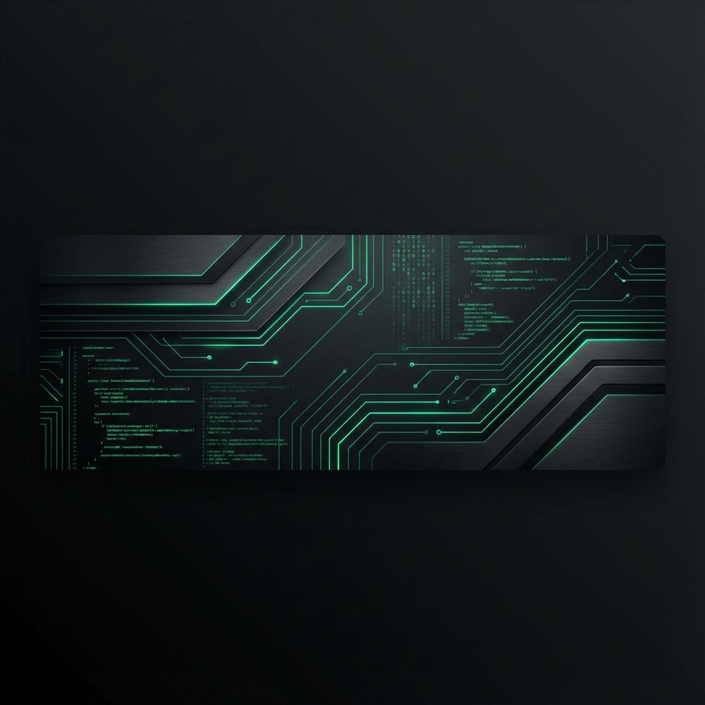

  

  

<h1 align="center">Hi there, I'm Burak! </h1>

  <strong>C# / .NET Developer | Simulation Enthusiast | Tool Builder</strong>

  <a href="https://buraaks.github.io">Website</a> •
  <a href="https://github.com/buraaks?tab=repositories">Projects</a> •
  <a href="mailto:burak@example.com">Contact</a>

---

### 🚀 About Me
- 🔭 **Current Project**: Refining the **BarnManagement API**, a complex agricultural simulation backend built with .NET 10 and EF Core.
- 🛠️ **Passion**: Creating seamless user experiences with **WPF** and **WinForms**, like my **OverlayPlayer** project.
- 📚 **Learning**: Exploring the cutting edge of **.NET 10**, clean architecture, and advanced SQL optimization.
- ⚡ **Fun Fact**: I enjoy building things quietly and letting the code speak for itself.

### 🛠️ Tech Stack

  
  
  
  
  
  

### 📊 My GitHub Journey

  
  

  

---

  <i>"Code is like humor. When you have to explain it, it’s bad."</i> 
  <strong>Building things quietly.</strong>

